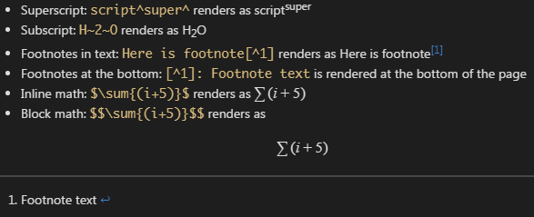

# Zettelkasten README

This is a simple extension which provides means to create links between Markdown documents in a 'Zettelkasten' way.

> IMPORTANT - this is a work in progress and is far from the product quality, so use it on your own risk and always make backups of your data.

## Usage

To create a link to a new file press "Ctrl + Shift + P / F1" and type "zettel", then choose command "New Zettel link" and press "Enter". Or you can use keyboard shortcut "Ctrl + Shift + =".

This will create a new link, like this:

```
(z:1507347558083)
```

Here "z" - is the zettelkasten link prefix (you can change this by overwriting config property `zettel.linkPrefix`), and the numbers are the timestamp of link creation operation. Now, if you CTRL-click this link you will be prompted to create a new file with this identifier in your current workspace folder.

If the file with such an identifier exists, CTRL-clicking on a link will open that file in a new editor tab.

## Additional Markdown syntax

This extension uses some additional `markdown-it` plugins to provide new elements, such as subscript or Latex math formulas. Here are the examples:



### Used markdown plugins

* [markdown-it-sup](https://www.npmjs.com/package/markdown-it-sup)
* [markdown-it-sub](https://www.npmjs.com/package/markdown-it-sub) 
* [markdown-it-footnote](https://www.npmjs.com/package/markdown-it-footnote)
* [markdown-it-container](https://www.npmjs.com/package/markdown-it-container)
* [markdown-it-katex](https://www.npmjs.com/package/markdown-it-katex)

## Credits

Logo image is created by [Aha-soft](http://www.aha-soft.com/) under [CC Attribution-Share Alike 4.0](http://creativecommons.org/licenses/by-sa/4.0/)